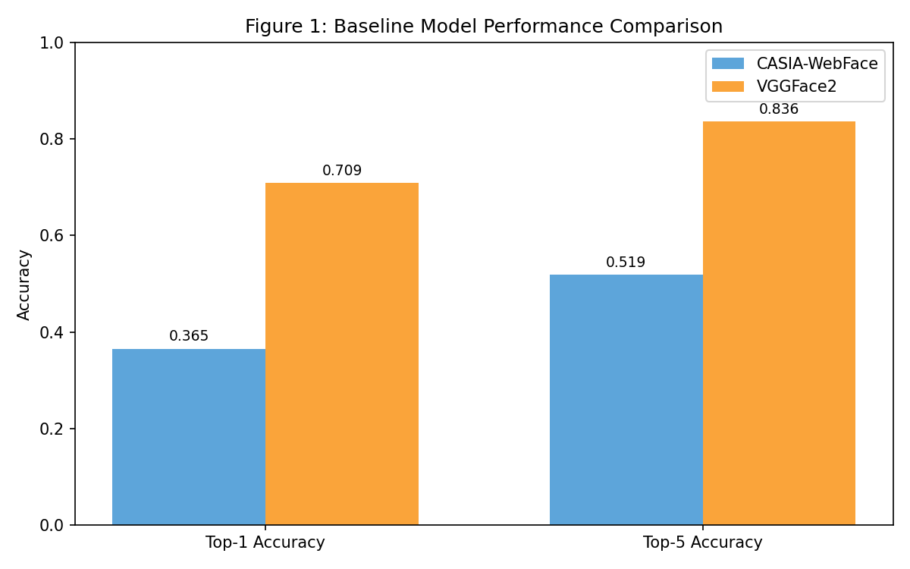
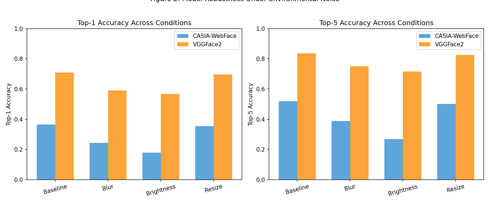
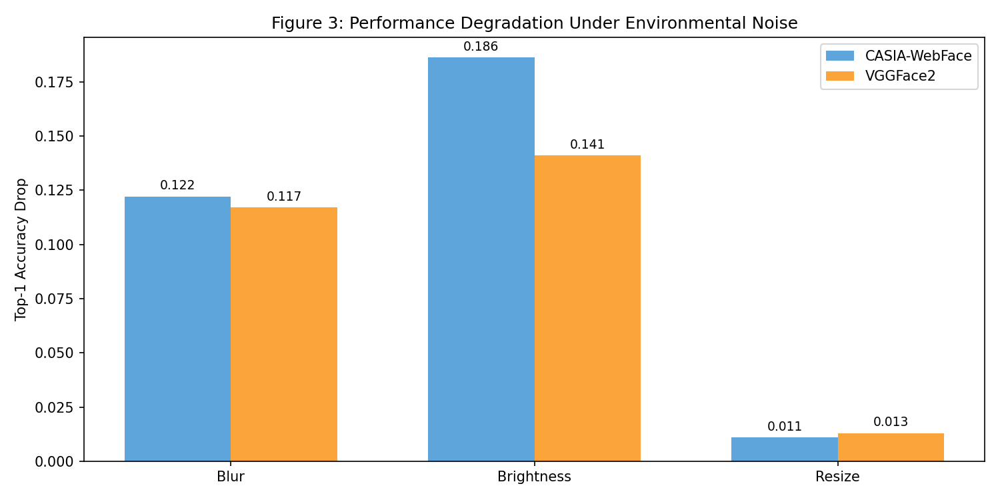
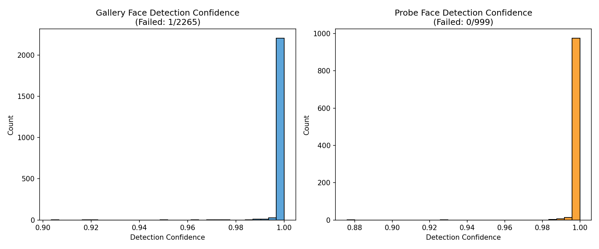
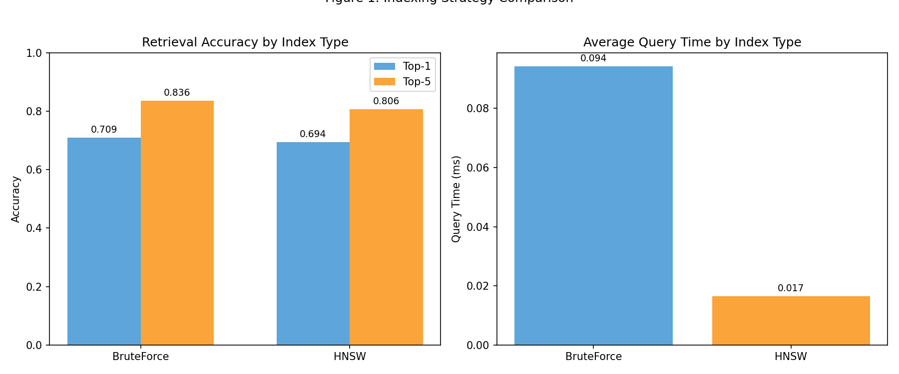
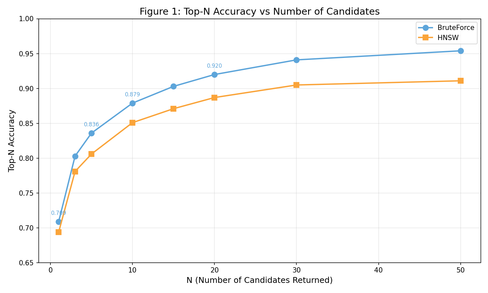
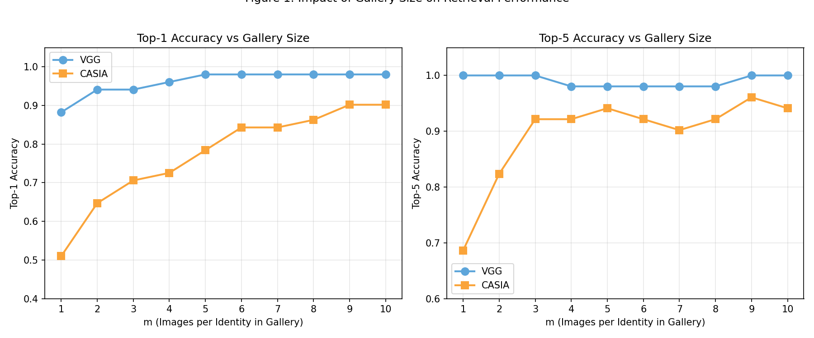
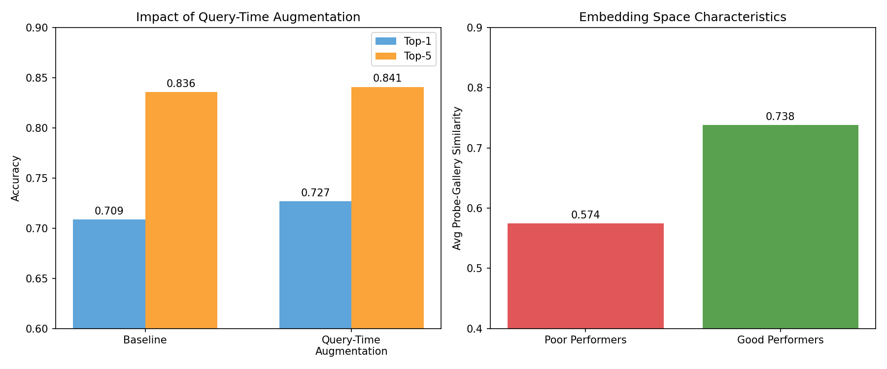

# IronClad Face Recognition: Case Analysis

## System Context

IronClad is a face recognition system designed for identity verification at scale. The system processes probe images (query faces) and retrieves the most similar identities from a gallery of known individuals. Its intended deployment involves handling up to a billion gallery images while returning candidate matches for human operators to review. The system's output serves security personnel who make final verification decisions based on the top-N candidates returned.

This deployment context creates specific requirements that shape every design decision in this analysis. **Recall is prioritized over precision** because missing a true match (false negative) forces operators to conduct manual searches, while returning extra candidates (false positive) simply adds a few seconds of review time. Additionally, the billion-scale requirement means that exact search methods may become computationally infeasible, forcing a trade-off between retrieval accuracy and query latency.

All experiments use a dataset of 1,000 identities with 2,265 gallery images and 999 probe images. The gallery contains between 1 and 10 images per identity, with 629 identities having only a single image. Unless otherwise stated, metrics are Top-1 accuracy (whether the correct identity is the nearest neighbor) and Top-5 accuracy (whether the correct identity appears in the top 5 results), using cosine similarity in a 512-dimensional embedding space.

The analysis is structured as a sequence of connected design decisions, where each task builds on the previous one and informs the next.

---

## Task 1: Model Selection

*Which embedding model should IronClad deploy, and how does it perform under realistic environmental conditions?*

### Methodology

Two pretrained embedding models were evaluated: CASIA-WebFace and VGGFace2. Both produce 512-dimensional face embeddings, but they differ in their training data and learned representations. To ensure a fair comparison, both models were evaluated using identical BruteForce retrieval with cosine similarity, which guarantees optimal nearest-neighbor results without approximation error.

Baseline performance was measured on the full dataset under clean conditions. To assess robustness, three environmental degradations were applied to probe images before embedding extraction: Gaussian blur (radius=2), brightness reduction (factor=0.6), and resize degradation (downscale to 0.5x then upscale back). These degradations simulate realistic deployment conditions such as motion blur, poor lighting, and low-resolution camera feeds.

### Results

**Table 1: Baseline Model Comparison**

| Model | Top-1 Accuracy | Top-5 Accuracy |
|-------|----------------|----------------|
| CASIA-WebFace | 0.3654 | 0.5185 |
| VGGFace2 | 0.7087 | 0.8358 |
| **Difference** | **+0.3433** | **+0.3173** |

Table 1 shows that VGGFace2 dramatically outperforms CASIA-WebFace under baseline conditions. The 34.33 percentage point gap in Top-1 accuracy is substantial. VGGFace2 correctly identifies the nearest neighbor in 70.87% of queries, while CASIA-WebFace succeeds only 36.54% of the time. This baseline difference alone strongly favors VGGFace2.

**Table 2: Performance Under Environmental Noise**

| Condition | CASIA Top-1 | VGG Top-1 | VGG Advantage |
|-----------|-------------|-----------|---------------|
| Baseline | 0.3654 | 0.7087 | +0.3433 |
| Blur | 0.2432 | 0.5916 | +0.3484 |
| Brightness | 0.1792 | 0.5676 | +0.3884 |
| Resize | 0.3544 | 0.6957 | +0.3413 |

Table 2 reveals that VGGFace2 maintains its advantage under all three degradation conditions. The performance gap actually widens under brightness reduction, where CASIA drops by 18.6 points while VGG drops by only 14.1 points. Both models are most robust to resize degradation and least robust to brightness reduction, but VGG consistently outperforms CASIA by 34+ percentage points across all conditions.

*Figure 1: Top-1 and Top-5 accuracy comparison between CASIA-WebFace and VGGFace2 under baseline conditions. VGGFace2 nearly doubles the performance of CASIA-WebFace.*

*Figure 2: Both models degrade under environmental noise, but VGGFace2 maintains a consistent advantage across all conditions.*

*Figure 3: Absolute drop in Top-1 accuracy from baseline for each degradation type. Both models struggle most with brightness reduction.*

### Limitations

This evaluation uses a single degradation level for each noise type. Performance curves across multiple degradation intensities would provide finer-grained insights into each model's robustness envelope. Additionally, the degradations were applied independently rather than combined, which may underestimate real-world performance loss when multiple factors co-occur.

### Design Decision

**VGGFace2 is the clear choice for deployment.** It outperforms CASIA-WebFace by 34+ percentage points under all tested conditions, with no trade-off to justify. The gap is so large that even under worst-case brightness degradation, VGGFace2 (56.76%) still outperforms CASIA-WebFace's baseline (36.54%). All subsequent analysis uses VGGFace2 as the embedding model.

---

## Task 2: Face Detection Preprocessing

*Does adding MTCNN face detection before embedding extraction improve retrieval performance?*

### Methodology

The baseline preprocessing pipeline resizes images to 224x224 and passes them directly to the embedding model. This assumes that images are already reasonably aligned and cropped. An alternative approach uses MTCNN (Multi-task Cascaded Convolutional Networks) to detect and crop faces before embedding extraction, which could improve performance by removing background noise and ensuring consistent face alignment.

MTCNN was configured with an output size of 224x224 and a margin of 20 pixels around detected faces. For images where MTCNN failed to detect a face, the original preprocessing pipeline was used as a fallback. Detection confidence scores were recorded to characterize the reliability of face detection across the dataset.

### Results

**Table 3: MTCNN Preprocessing Impact**

| Method | Top-1 Accuracy | Top-5 Accuracy |
|--------|----------------|----------------|
| Without MTCNN (baseline) | 0.7087 | 0.8358 |
| With MTCNN | 0.8428 | 0.8969 |
| **Improvement** | **+0.1341** | **+0.0611** |

Table 3 shows that MTCNN preprocessing dramatically improves retrieval performance. Top-1 accuracy jumps from 70.87% to 84.28%, a gain of 13.41 percentage points. Top-5 accuracy also improves by 6.11 points. This is a substantial improvement that requires no model retraining, only a preprocessing change.

**Table 4: MTCNN Detection Statistics**

| Dataset | Failed Detections | Detection Rate | Mean Confidence |
|---------|-------------------|----------------|-----------------|
| Gallery (2,265 images) | 1 | 99.96% | 0.9995 |
| Probe (999 images) | 0 | 100.00% | 0.9994 |

Table 4 shows that MTCNN achieves near-perfect detection rates with very high confidence. Only 1 gallery image out of 2,265 failed detection, and all probe images were successfully processed. The mean confidence score of 0.9995 indicates that MTCNN is highly certain about its detections, which suggests the LFW-derived dataset contains well-framed face images that align well with MTCNN's training distribution.

*Figure 4: Distribution of MTCNN detection confidence scores. Nearly all detections cluster near 1.0, indicating high reliability.*

### Interpretation

The 13.41 point improvement from MTCNN preprocessing is larger than any other single intervention tested in this analysis. This suggests that the baseline images, while containing faces, include enough background variation and alignment inconsistency to significantly degrade embedding quality. MTCNN normalizes these variations by extracting a consistent face crop.

The near-perfect detection rate (99.97% overall) indicates that MTCNN can be applied without significant risk of dropping images. The single failed detection in the gallery can be handled gracefully through the fallback mechanism.

### Design Decision

**MTCNN preprocessing should be adopted.** The 13+ point improvement in Top-1 accuracy far outweighs the modest computational cost of running face detection. Given the near-perfect detection rate, the risk of dropping valid images is negligible. This preprocessing change should be applied to both gallery enrollment and probe queries at deployment time.

---

## Task 3: Indexing Strategy Selection

*Which indexing strategy should IronClad use, and how will it perform at billion-scale deployment?*

### Methodology

Three indexing strategies were evaluated: BruteForce (exact search), HNSW (Hierarchical Navigable Small World graphs), and LSH (Locality-Sensitive Hashing). BruteForce computes cosine similarity against every gallery vector and guarantees optimal results. HNSW builds a navigable graph structure that enables approximate nearest-neighbor search in logarithmic time. LSH uses hash functions to bucket similar vectors together for constant-time lookup.

Due to FAISS library instability on the test system, LSH could not be empirically evaluated. Results are reported for BruteForce and HNSW, with theoretical analysis provided for LSH. Query times were measured per-probe and averaged across all 999 queries.

### Results

**Table 5: Indexing Strategy Comparison (2,265 gallery vectors)**

| Method | Top-1 | Top-5 | Query Time (ms) |
|--------|-------|-------|-----------------|
| BruteForce | 0.7087 | 0.8358 | 0.099 |
| HNSW | 0.6937 | 0.8058 | 0.016 |
| **Difference** | **-0.0150** | **-0.0300** | **6.2x faster** |

Table 5 shows that HNSW achieves 6.2x faster query times while sacrificing only 1.5 percentage points of Top-1 accuracy. The Top-5 gap is 3.0 points. At the current dataset scale, both methods complete queries in under a millisecond, so the speed advantage is not yet important.

**Table 6: Billion-Scale Extrapolation**

| Method | Search Complexity | Est. Query Time | Memory |
|--------|-------------------|-----------------|--------|
| BruteForce | O(n) | 43.7 seconds | 1,907 GB |
| HNSW | O(log n) | 0.044 ms | 2,027 GB |
| LSH | O(1) average | <1 ms | 1,922 GB |

Table 6 extrapolates performance to a billion-image gallery. BruteForce becomes completely impractical at this scale, requiring 43.7 seconds per query. HNSW scales due to its logarithmic complexity, maintaining sub-millisecond query times. LSH would theoretically achieve constant-time lookup but typically suffers larger accuracy penalties than HNSW.

*Figure 5: Left panel shows accuracy comparison between BruteForce and HNSW. Right panel shows query time comparison, with HNSW achieving 6x speedup.*

### Interpretation

At the current 2,265-image scale, BruteForce is perfectly viable and provides the highest accuracy. However, the billion-scale requirement fundamentally changes the game. A 43.7-second query time is unacceptable for interactive use, making approximate methods mandatory.

HNSW offers the best balance of accuracy and scalability. Its 1.5% accuracy penalty is modest, and its logarithmic scaling ensures that query times remain practical even at extreme scale. The 6% memory overhead (2,027 GB vs 1,907 GB) for storing graph edges is acceptable given the performance benefits.

### Design Decision

**For current deployment, BruteForce is acceptable.** At 2,265 images, exact search completes in under a millisecond and provides optimal accuracy.

**For billion-scale deployment, HNSW is required.** The 1.5% accuracy penalty is an acceptable trade-off for maintaining sub-millisecond query times. BruteForce would render the system unusable at scale.

---

## Task 4: Number of Identities Returned (N)

*How many candidate identities should IronClad return to human operators?*

### Methodology

The parameter N controls how many candidate identities the system presents for human review. Larger N increases the probability that the true identity appears in the candidate set (Top-N accuracy) but also increases operator workload. The optimal N balances recall against review burden.

Top-N accuracy was measured for N values ranging from 1 to 50 using both VGGFace2 and CASIA-WebFace with BruteForce retrieval. HNSW results were also collected to assess whether the choice of N should differ between indexing strategies.

### Results

**Table 7: Top-N Accuracy for VGGFace2**

| N | BruteForce | HNSW | Difference |
|---|------------|------|------------|
| 1 | 0.7087 | 0.6937 | -0.0150 |
| 5 | 0.8358 | 0.8058 | -0.0300 |
| 10 | 0.8789 | 0.8509 | -0.0280 |
| 20 | 0.9199 | 0.8869 | -0.0330 |
| 50 | 0.9540 | 0.9109 | -0.0431 |

Table 7 shows diminishing returns as N increases. Moving from N=1 to N=5 gains 12.71 points of accuracy. Moving from N=5 to N=10 gains only 4.31 points. Moving from N=10 to N=20 gains 4.10 points. The marginal benefit decreases while operator workload increases linearly.

**Table 8: Top-N Accuracy Comparison Across Models**

| N | VGG BruteForce | CASIA BruteForce |
|---|----------------|------------------|
| 1 | 0.7087 | 0.3654 |
| 5 | 0.8358 | 0.5185 |
| 10 | 0.8789 | 0.5736 |
| 20 | 0.9199 | 0.6336 |

Table 8 confirms that VGGFace2 outperforms CASIA-WebFace at every N value. Even at N=50, CASIA (70.57%) cannot match VGGFace2's performance at N=5 (83.58%). This reinforces the model selection decision from Task 1.

*Figure 6: Top-N accuracy as a function of N for BruteForce and HNSW. Both curves show diminishing returns beyond N=10.*

### Interpretation

The curve flattens significantly after N=10. At N=5, VGGFace2 achieves 83.58% accuracy with BruteForce, meaning operators review 5 candidates and find the correct match 83.6% of the time. At N=10, this rises to 87.89%. The 4.31 point gain comes at the cost of doubling the review workload.

The gap between BruteForce and HNSW widens slightly at higher N values (from 1.5 points at N=1 to 4.3 points at N=50). This suggests that HNSW's approximation errors accumulate in the lower-ranked results. For deployment, this means N should be kept moderate to minimize the impact of approximate search.

### Design Decision

**N=5 is recommended for standard operation.** It achieves 83.58% Top-5 accuracy while keeping operator workload manageable. Operators can review 5 candidates quickly, and the correct identity will be present in the vast majority of cases.

**N=10 is recommended for high-security scenarios.** When missing a match is particularly costly, increasing to N=10 provides 87.89% accuracy at the cost of doubled review time.

N values beyond 10 are not recommended. The marginal accuracy gains do not justify the increased operator burden.

---

## Task 5: Gallery Size Optimization

*How many images per identity should be enrolled in the gallery?*

### Methodology

The parameter m controls how many images per identity are stored in the gallery. More images per identity could improve retrieval by providing multiple reference points that capture pose, lighting, and expression variation. However, more images also increase storage costs and query times.

Designing a fair experiment required careful attention. Simply using all identities at each m value would compare different identity sets (since only some identities have 10 images). Instead, the experiment was restricted to the 51 identities that have exactly 10 images in the gallery. For each m from 1 to 10, the first m images per identity were used, ensuring the same identities were compared across all conditions.

### Results

**Table 9: Gallery Size Impact (51 identities with 10 images each)**

| m | VGG Top-1 | VGG Top-5 | CASIA Top-1 | CASIA Top-5 |
|---|-----------|-----------|-------------|-------------|
| 1 | 0.8824 | 1.0000 | 0.5098 | 0.6863 |
| 2 | 0.9412 | 1.0000 | 0.6471 | 0.8235 |
| 3 | 0.9412 | 1.0000 | 0.7059 | 0.9216 |
| 5 | 0.9804 | 0.9804 | 0.7843 | 0.9412 |
| 10 | 0.9804 | 1.0000 | 0.9020 | 0.9412 |

Table 9 reveals strikingly different patterns for the two models. VGGFace2 saturates quickly: Top-1 accuracy reaches 98.04% at m=5 and does not improve further. CASIA-WebFace shows continuous improvement from 50.98% at m=1 to 90.20% at m=10, nearly doubling its performance.

*Figure 7: Top-1 (left) and Top-5 (right) accuracy as gallery size increases. VGGFace2 saturates at m=5 while CASIA-WebFace continues improving.*

### Interpretation

The models exhibit different behaviors because of their embedding quality. VGGFace2 produces embeddings that are already highly discriminative from a single image. Adding more reference images provides diminishing returns because the first image already captures most of the identity-relevant information.

CASIA-WebFace produces weaker embeddings that benefit substantially from multiple reference points. Each additional image provides new information that helps distinguish the identity from others. This suggests CASIA-WebFace embeddings are more sensitive to pose and expression variation.

### Limitations

This experiment used only 51 identities (those with 10 images), which may not be representative of the full population. Identities with more available images in the original dataset might be inherently easier to recognize. The results should be interpreted as indicative rather than definitive.

### Design Decision

**For VGGFace2, m=5 is optimal.** Performance saturates at this point, and additional images provide no accuracy benefit while increasing storage and query costs.

**For CASIA-WebFace, maximize m.** Since CASIA continues improving up to m=10, deploying CASIA would require collecting as many images per identity as possible. This reinforces the model selection decision: VGGFace2 achieves better performance with fewer images per identity.

---

## Additional Analysis: Uncertainty Estimation and Improvement Strategy

*Which identities does the system struggle with, and can query-time augmentation improve performance?*

### Methodology

To characterize uncertainty, per-identity performance was computed across all 999 probe images. Identities were classified as "poor performers" (0% Top-1 accuracy) or "good performers" (100% Top-1 accuracy). Embedding space characteristics were then compared between these groups to understand why some identities are harder to recognize.

A query-time augmentation (QTA) strategy was proposed and evaluated. Instead of using the raw probe image, six augmented versions were created (original plus brightness variations, contrast variations, and horizontal flip), embedded separately, and averaged to produce a more robust query embedding. This approach does not modify the gallery.

### Results

**Table 10: Identity Performance Distribution**

| Category | Count | Percentage |
|----------|-------|------------|
| Poor performers (0% Top-1) | 291 | 29.1% |
| Good performers (100% Top-1) | 708 | 70.8% |

Table 10 shows that nearly 30% of identities are never correctly identified at Top-1, while over 70% are always correctly identified. This distribution suggests systematic differences between easy and hard identities rather than random variation.

**Table 11: Embedding Space Characteristics**

| Metric | Poor Performers | Good Performers |
|--------|-----------------|-----------------|
| Avg probe-gallery similarity | 0.5744 | 0.7380 |
| Avg gallery variance | 0.000050 | 0.000198 |

Table 11 reveals the key difference: poor performers have substantially lower similarity between their probe embeddings and gallery embeddings (0.574 vs 0.738). Their probe images embed far from their own gallery images, causing retrieval to return the wrong identity. Interestingly, poor performers also have lower within-gallery variance, suggesting their gallery images may be too homogeneous to capture the variation present in probe images.

**Table 12: Query-Time Augmentation Results**

| Method | Top-1 | Top-5 |
|--------|-------|-------|
| Baseline | 0.7087 | 0.8358 |
| Query-Time Augmentation | 0.7267 | 0.8408 |
| **Improvement** | **+0.0180** | **+0.0050** |

Table 12 shows that QTA improves Top-1 accuracy by 1.80 percentage points and Top-5 by 0.50 points. While modest compared to the MTCNN improvement, this gain requires no preprocessing changes and can be applied at query time.

**Table 13: Impact on Poor Performers**

| Metric | Count |
|--------|-------|
| Total poor performers | 291 |
| Improved with QTA | 23 (7.9%) |
| Still at 0% | 268 (92.1%) |

Table 13 shows that QTA helped 23 previously-failing identities achieve correct Top-1 matches. While 92.1% of poor performers remain at 0%, the 7.9% improvement rate shows that averaging across augmentations can recover some hard cases.

*Figure 8: Left panel shows the accuracy improvement from QTA. Right panel shows the embedding similarity gap between poor and good performers.*

### Interpretation

The core finding is that poor performers suffer from a probe-gallery mismatch in embedding space. Their probe images embed in a different region than their gallery images, likely due to pose, expression, or lighting differences that the model fails to normalize. Good performers have probe images that embed close to their gallery images, making retrieval straightforward.

QTA partially addresses this by creating multiple probe representations and averaging them. This smooths out some variation and moves the query embedding closer to a "canonical" representation. However, the 1.8% improvement indicates that QTA is not a complete solution. More sophisticated approaches such as gallery augmentation, test-time adaptation, or model fine-tuning may be needed to substantially improve poor performer accuracy.

### Design Decision

**Query-time augmentation should be deployed.** The 1.8% improvement is essentially free at inference time (6x embedding cost per query) and helps recover some hard cases. It complements rather than replaces the MTCNN preprocessing improvement from Task 2.

**Future work should focus on gallery diversity.** The low within-gallery variance for poor performers suggests that enrolling more diverse gallery images (different poses, expressions, lighting) could substantially improve performance for hard identities.

---

## Conclusion

This analysis followed a connected sequence of design decisions for the IronClad face recognition system:

1. **VGGFace2 was selected** over CASIA-WebFace because it delivers 34+ percentage points higher Top-1 accuracy under all tested conditions. The gap is so large that even degraded VGGFace2 performance exceeds CASIA-WebFace's baseline. This decision propagates through all subsequent analysis.

2. **MTCNN face detection preprocessing was adopted** after demonstrating a 13.41 percentage point improvement in Top-1 accuracy (70.87% to 84.28%). With a 99.97% detection rate and 0.9995 mean confidence, MTCNN can be applied reliably to both gallery enrollment and probe queries. This is the single largest improvement identified in the analysis.

3. **HNSW indexing is required for billion-scale deployment** despite a 1.5% accuracy penalty compared to BruteForce. At billion scale, BruteForce would require 43.7 seconds per query, rendering the system unusable. HNSW maintains practical query times through logarithmic scaling, though real-world performance at billion scale will depend on hardware and memory locality.

4. **N=5 is recommended** as the default number of candidates returned. This achieves 83.58% Top-5 accuracy while keeping operator review burden manageable. For high-security scenarios, N=10 increases accuracy to 87.89% at the cost of doubled review time.

5. **m=5 images per identity is optimal for VGGFace2.** Performance saturates at this point, and additional images provide no accuracy benefit. This is operationally convenient since it limits enrollment requirements.

6. **Query-time augmentation provides a 1.8% improvement** by averaging embeddings across augmented versions of the probe image. While not transformative, this technique is essentially free and helps recover some hard cases where probe-gallery mismatch would otherwise cause failure.

Across all six tasks, one pattern emerges consistently: **preprocessing quality dominates model performance.** The largest improvement came not from model selection or parameter tuning, but from MTCNN face detection. This suggests that for deployed face recognition systems, investment in robust preprocessing pipelines may yield higher returns than investment in more sophisticated embedding models.

The remaining 29% of identities that fail at Top-1 represent the system's current ceiling. These hard cases exhibit low probe-gallery similarity that neither model selection nor query augmentation fully addresses. Closing this gap will likely require either more diverse gallery enrollment or model architectures specifically designed to handle within-identity variation.

---
